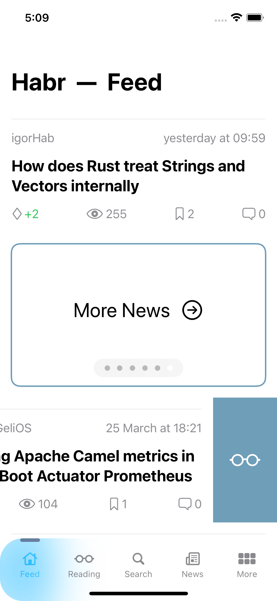
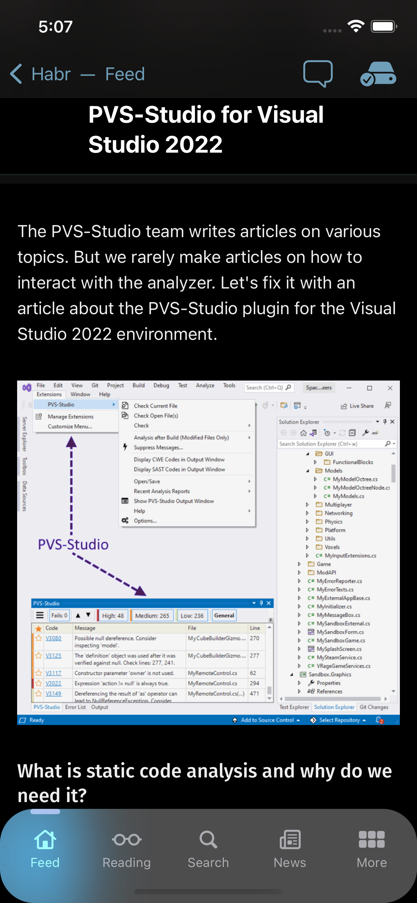

  
  <h2 align="center">habr mobile</h2>
 

## About the Project

habr mobile is a client for [habr.com](https://habr.com) written with SwiftUI. Habr is a massive blog platform with multimillion and multicultural audience where people post interesting content on different topics, discuss trends and much more. With habr mobile app, you can take all that goodness with you on the go with finger-tip access to the latest news and posts. 

Main Screen & Post View

    &nbsp;
   

## Built With

* [SwiftUI](https://developer.apple.com/xcode/swiftui) 2.0 → 3.0
* [CoreData](https://developer.apple.com/documentation/coredata)
* [Combine](https://developer.apple.com/documentation/combine)
* [GDC](https://developer.apple.com/documentation/DISPATCH)
* [Matched Geometry Effect](https://designcode.io/swiftui-ios15-part2-matched-geometry-effect)
* [Custom Tab Bar](https://designcode.io/swiftui-ios15-custom-tab-bar)
* [Alert Toast](https://github.com/elai950/AlertToast)
* [SwiftSoup](https://github.com/scinfu/SwiftSoup)

(<a href="#top">back to top</a>)

## Features

* 123
* 234
* 345

## Installation

Simply download project with Code → Download ZIP, unpack it and run habr.xcodeproj. Or you can run it through Code → Open with Xcode. 

### Requirements
- iOS 14.0+
- Xcode 12.0+

## Roadmap

- [x] Custom Tab Bar
- [x] Custom transitions for Reading List
- [ ] Add compatibility with user profile
- [ ] Color correction for dark scheme
- [ ] Asynch loading for comments
- [ ] iPad adaptation 
- [ ] Deep Links & Quick Actions

(<a href="#top">back to top</a>)

## License

Distributed under the MIT License.

(<a href="#top">back to top</a>)

---

> Email: illusionlance@gmail.com &nbsp;&middot;&nbsp;
> GitHub: [https://github.com/AnthonyJustt](https://github.com/AnthonyJustt) &nbsp;&middot;&nbsp;
> LinkedIn: [Anton K.](https://www.linkedin.com/in/a-krivonozhenkov)

(<a href="#top">back to top</a>)

Preview

  
  

 Initial screens

  
  

 Initial screens with Glass Morphism for iOS 15

  
  

by <a href="https://www.youtube.com/watch?v=LbpGjAJRhLM" target="_blank">kavsoft</a>

 Adding article to reading list

  
  

 Reading List

  
  

 Article with dark theme

  
  

  
  

 Comments

  
  

